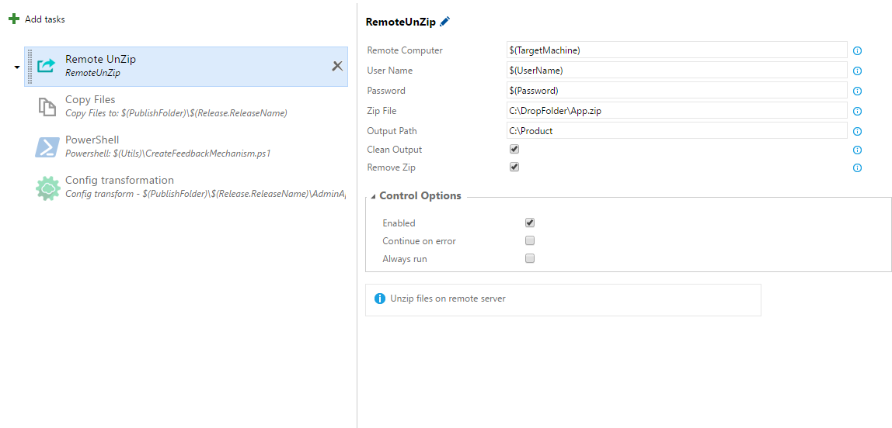

Unzip your compressed files zip,rar,.. on remote machine

This extension will give you usefull task that help you to exract your compressed files on remote machine

##Configure your release task

#####Remote Computer
    Remote machine ip address
#####UserName
    User name on remote machine with privilage
#####Password
    password for remote user name
#####Zip File
    File that you want to extract. Path must be placed on remote machine.
#####Output Path
    Result store in this path . Must be placed in remote machine .
#####Clean Output (Deprecated)
#####Remove Zip file
    Remote zip file after extract.